# BookChain

> Decentralized second-hand book trading platform on Solana

On-chain Escrow · NFT Tokenization · End-to-End Encrypted Shipping · Decentralized Arbitration

[中文文档](#bookchain-1) | [English](#bookchain)

---

## Overview

BookChain is a full-stack dApp built on Solana. Buyers and sellers authenticate via wallet signatures — no passwords, no accounts. Books are tokenized as NFTs via Metaplex Core, funds are held in a trustless on-chain escrow, and disputes are resolved by a 2-of-3 multi-sig arbitration DAO. Every step is transparent and auditable on-chain.

---

## Tech Stack

| Layer | Technologies |
|-------|-------------|
| On-chain | Anchor 0.31 · Solana · Metaplex Core |
| Backend | Rust · Axum · SQLx · PostgreSQL · Redis · Tokio |
| Frontend | React · TypeScript · Tailwind CSS · shadcn/ui · Solana Wallet Adapter |
| Storage | Pinata / IPFS |
| Misc | Google Books API · Live SOL/CNY rate · Sonyflake distributed ID |

---

## Features

### On-Chain Program (Anchor)

| Instruction | Description |
|-------------|-------------|
| `create_book` | Mint a book NFT; metadata hash stored on-chain to prevent tampering |
| `update_book_price` | Seller updates listing price |
| `relist_book` | Re-list a book with optional metadata update |
| `delist_book` | Remove a listing |
| `create_escrow` | Buyer locks funds into on-chain escrow |
| `set_pre_ship_lock` | Freeze NFT; enter pre-shipment state |
| `ship_book` | Submit shipping commitment hash (Commit-Reveal privacy scheme) |
| `confirm_escrow` | Buyer confirms receipt; funds released to seller, NFT transferred |
| `cancel_escrow` | Cancel trade; funds returned to buyer |
| `open_dispute` | Raise a dispute |
| `resolve_dispute` | Arbitrators cast 2-of-3 multi-sig vote; supports partial refund and book return |

### Backend

- **Auth**: Sign-In With Solana (SIWS) + Nonce/Redis anti-replay + JWT blacklist for explicit logout
- **Books**: List / delist / reprice / search — PostgreSQL GIN full-text index (tsvector + auto-update trigger) + pg_trgm fuzzy matching
- **Chat**: WebSocket real-time messaging; X25519 ECDH key exchange + AES-GCM encryption for shipping addresses and tracking numbers; BookOffer cards, read receipts
- **Chain Sync**: Periodic reconciliation job to keep DB in sync with on-chain state; WebSocket subscription for arbitration result events
- **Arbitration**: Evidence submission, dispute status tracking
- **Misc**: Google Books API for quick book entry, live SOL/CNY exchange rate, multipart image upload with compression

### Frontend

- Multi-wallet support via Solana Wallet Adapter (Phantom, etc.)
- Marketplace: book listings, multi-dimensional filtering (category / condition / price), favorites
- Bookshelf: my listings / my purchases / order progress tracking
- Chat: real-time conversation list + message stream
- Arbitration dashboard: evidence submission, dispute brief view


---

## Project Structure

```
solana-book-platform/
├── packages/
│   ├── book/                  # On-chain program
│   │   └── programs/book/src/
│   │       ├── instructions/  # book/ and escrow/ instructions
│   │       ├── state/         # BookAccount / EscrowAccount
│   │       └── error.rs
│   └── web/                   # Frontend
│       ├── app/               # App Router pages
│       ├── components/        # features/ layout/ shared/ ui/
│       └── lib/               # api/ hooks/ encryption/
└── book_server/               # Backend
    ├── src/
    │   ├── auth/              # SIWS auth
    │   ├── chat/              # WebSocket chat
    │   ├── client/            # Anchor client / on-chain interaction
    │   ├── db/                # SQLx database layer
    │   ├── handlers/          # HTTP route handlers
    │   ├── reconcile/         # Chain-DB sync
    │   └── infra/             # Exchange rate, rate limiting, etc.
    └── migrations/            # PostgreSQL migrations
```

---

## Getting Started

### Prerequisites

- Rust 1.78+
- Node.js 20+
- PostgreSQL 15+
- Redis
- Solana CLI + Anchor CLI
- Yarn

### On-chain Program

```bash
cd packages/book
anchor build
# After build, copy the generated IDL JSON to book_server/idls/
# Also copy target/deploy/book.so to the corresponding directory
# Make sure your local wallet has enough Devnet SOL before deploying
anchor deploy --provider.cluster devnet
```

### Backend

```bash
# Fill in all required environment variables in .env first
cd book_server
sqlx migrate run
cargo run
```

### Frontend

```bash
cd packages/web
yarn install
yarn dev
```

---

## On-chain Deployment

- **Network**: Solana Devnet
- **Program ID**: `AQG2ZMQuQYSaSjxJwmsqQsASWChXwkTza2BRxKqBwHoC`

> To redeploy with a new program ID: run `solana-keygen new` to generate a new keypair, place it in `packages/book/target/deploy/`, then run `anchor keys sync` before building and deploying.

---

---

# BookChain

> 基于 Solana 区块链的去中心化二手书交易平台

链上托管 · NFT 资产化 · 端到端加密通讯密钥 · 去中心化仲裁

---

## 项目简介

BookChain 是基于 Solana 区块链的全栈去中心化应用，买卖双方通过钱包签名完成身份验证，书籍以 NFT 形式上链，交易资金由智能合约托管，无需信任任何中间方。发生纠纷时由链上仲裁员 2/3 多签裁决，过程完全透明可审计。

---

## 技术栈

| 层次 | 技术 |
|------|------|
| 链上程序 | Anchor 0.31 · Solana · Metaplex Core |
| 后端 | Rust · Axum · SQLx · PostgreSQL · Redis · Tokio |
| 前端 | React · TypeScript · Tailwind CSS · shadcn/ui · Solana Wallet Adapter |
| 存储 | Pinata / IPFS |
| 其他 | Google Books API · 实时汇率（SOL/CNY）· Sonyflake 分布式 ID |

---

## 功能模块

### 链上程序（Anchor）

| 指令 | 说明 |
|------|------|
| `create_book` | 铸造书籍 NFT，元数据哈希上链防篡改 |
| `update_book_price` | 卖家修改售价 |
| `relist_book` | 重新上架，支持更新元数据 |
| `delist_book` | 下架书籍 |
| `create_escrow` | 买家付款，资金进入链上托管 |
| `set_pre_ship_lock` | 冻结 NFT，进入发货准备状态 |
| `ship_book` | 提交发货承诺哈希（Commit-Reveal 隐私方案） |
| `confirm_escrow` | 买家确认收货，资金释放给卖家，NFT 转移 |
| `cancel_escrow` | 取消交易，资金退回买家 |
| `open_dispute` | 发起仲裁 |
| `resolve_dispute` | 仲裁员 2/3 多签裁决，支持部分退款与书籍退回 |

### 后端

- **鉴权**：SIWS（Sign In With Solana）钱包签名 + Nonce（Redis 消费防重放）+ JWT（黑名单机制支持主动登出）
- **书籍**：上架/下架/改价/搜索，PostgreSQL GIN 全文索引（tsvector + 自动更新触发器）+ pg_trgm 模糊搜索
- **聊天**：WebSocket 实时通信，X25519 ECDH 协商会话密钥 + AES-GCM 加密保护物流信息（收货地址、运单号等隐私数据），支持 BookOffer 报价单、已读回执
- **链上同步**：定时对账链上状态与数据库一致性；WebSocket 订阅监听仲裁结果事件
- **仲裁**：证据提交、纠纷状态跟踪
- **其他**：Google Books API 辅助录入、实时 SOL/CNY 汇率、图片 multipart 上传 + 压缩

### 前端

- Phantom / 多钱包适配（Solana Wallet Adapter）
- 市场页：书籍列表、多维筛选（类目/品相/价格）、收藏
- 书架页：我卖的 / 我买的 / 交易进度跟踪
- 聊天页：实时会话列表 + 消息流
- 仲裁台：证据提交、仲裁简报查看


---

## 项目结构

```
solana-book-platform/
├── packages/
│   ├── book/                  # 链上程序
│   │   └── programs/book/src/
│   │       ├── instructions/  # book/ 和 escrow/ 指令
│   │       ├── state/         # BookAccount / EscrowAccount
│   │       └── error.rs
│   └── web/                   # 前端
│       ├── app/               # App Router 页面
│       ├── components/        # features/ layout/ shared/ ui/
│       └── lib/               # api/ hooks/ encryption/
└── book_server/               # 后端
    ├── src/
    │   ├── auth/              # SIWS 登录
    │   ├── chat/              # WebSocket 聊天
    │   ├── client/            # anchor-client 链上交互
    │   ├── db/                # SQLx 数据库
    │   ├── handlers/          # HTTP 路由处理
    │   ├── reconcile/         # 链上数据同步
    │   └── infra/             # 汇率、限流等基础设施
    └── migrations/            # Pg 迁移文件
```

---

## 如何运行

### 环境要求

- Rust 1.78+
- Node.js 20+
- PostgreSQL 15+
- Redis
- Solana CLI + Anchor CLI
- Yarn

### 链上程序

```bash
cd packages/book
anchor build
# anchor build 之后得到 IDL 的 JSON 文件，复制到 book_server/idls/ 下
# 同时把 target/deploy/book.so 复制到对应目录
# 部署前确保本地钱包有足够的 Devnet 代币
anchor deploy --provider.cluster devnet
```

### 后端

```bash
# 先填写 .env 中的环境变量
cd book_server
sqlx migrate run
cargo run
```

### 前端

```bash
cd packages/web
yarn install
yarn dev
```

---

## 链上部署

- **网络**：Solana Devnet
- **程序 ID**：`AQG2ZMQuQYSaSjxJwmsqQsASWChXwkTza2BRxKqBwHoC`

> 修改程序 ID：使用 `solana-keygen new` 生成新密钥对，放到 `packages/book/target/deploy/` 下，然后运行 `anchor keys sync` 同步后再构建和部署。

---

## 运行截图

### 主页 / Home


### 钱包连接 / Wallet Connect
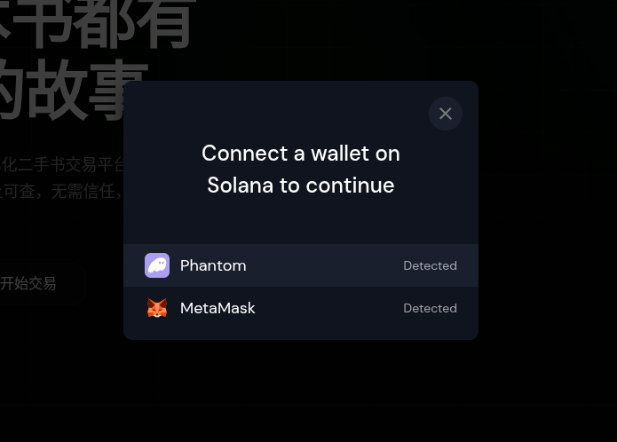

### 签名登录 / SIWS Login
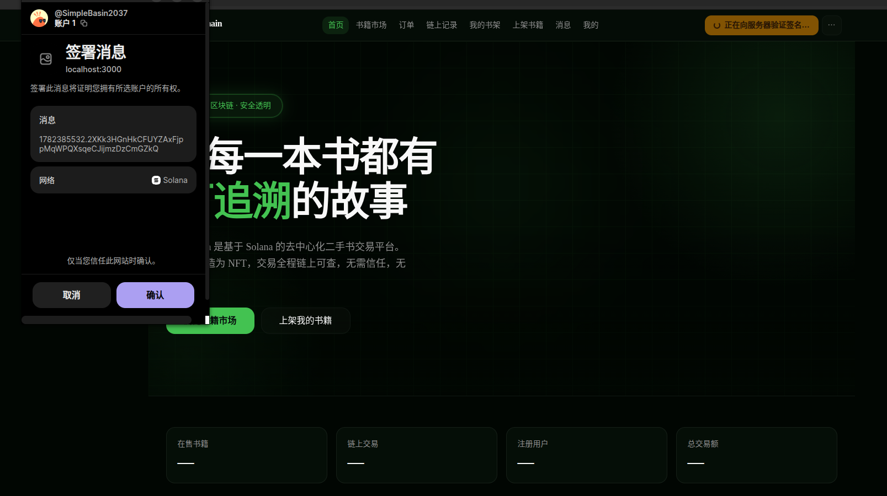

### 上架 & 交易 / Listing & Trade
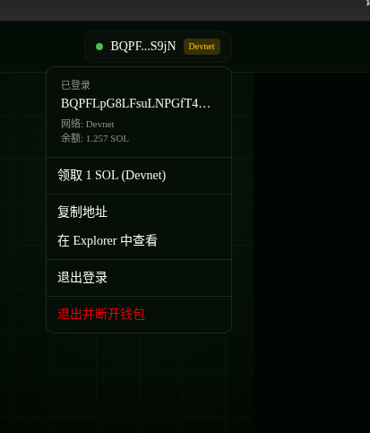
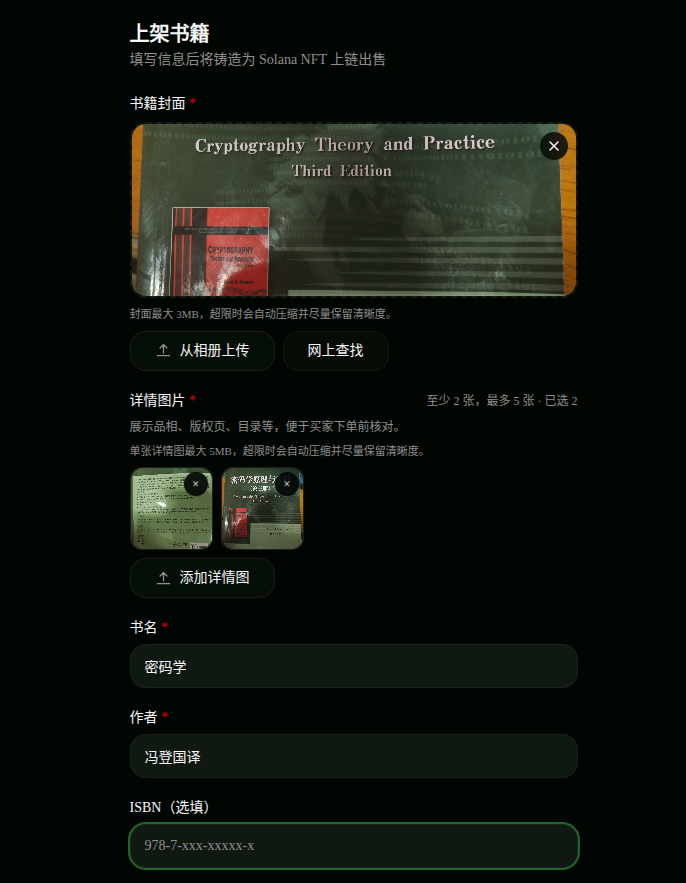
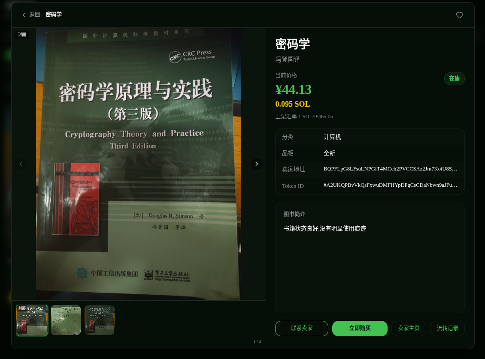
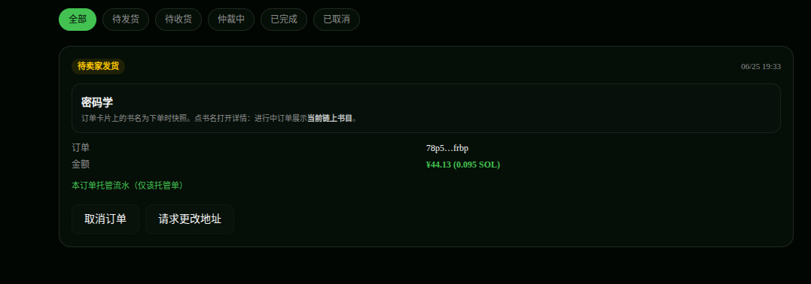
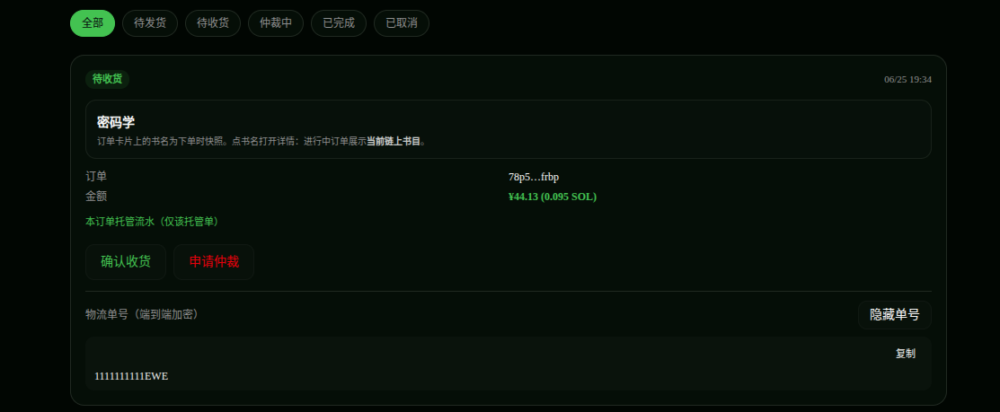
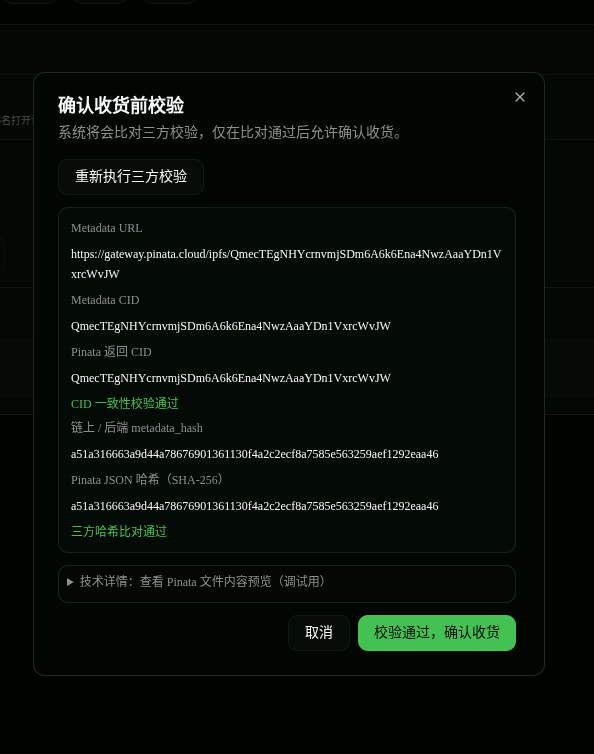

### 交易流水 / Transaction History
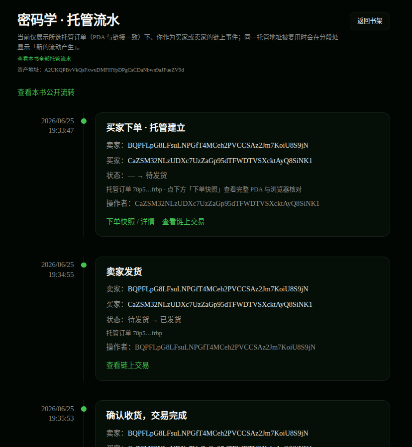

### Pinata 存储 & 链上交易信息 / Pinata Storage & On-chain TX
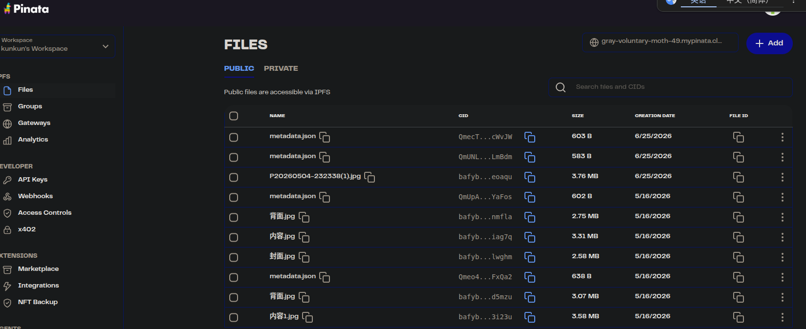
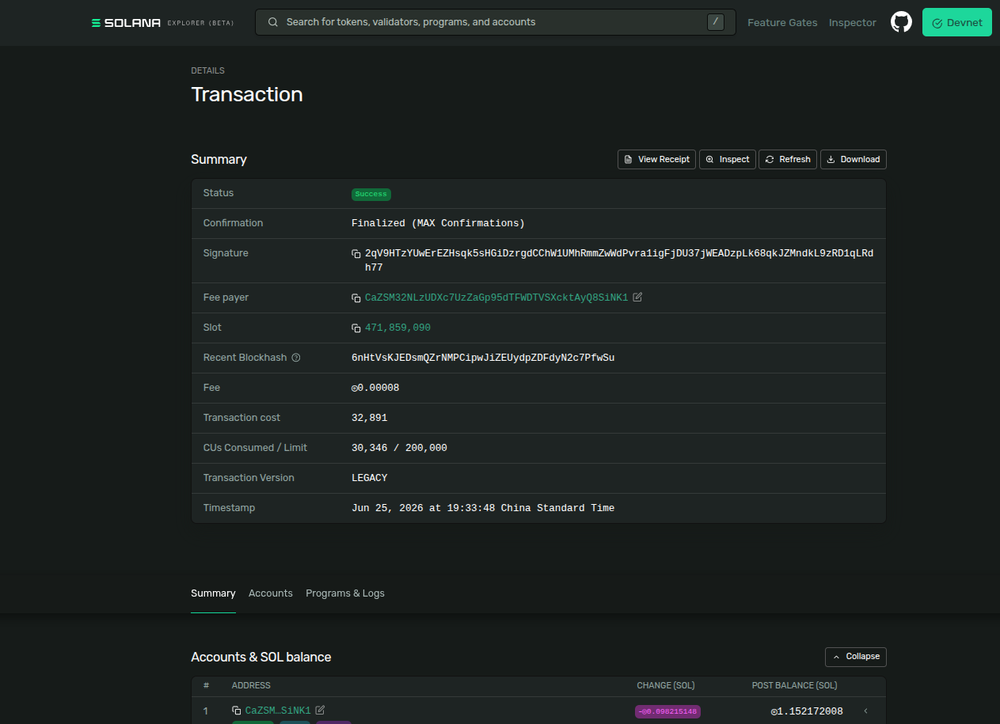

---

## 作者 / Author

kunkun

## License

MIT